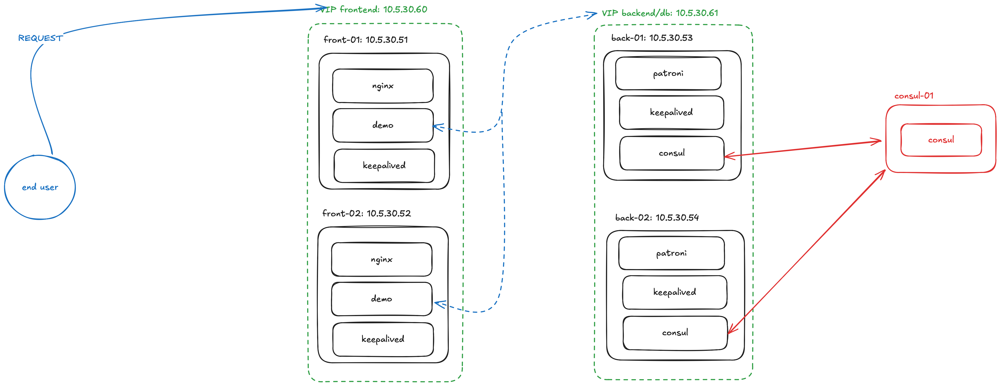
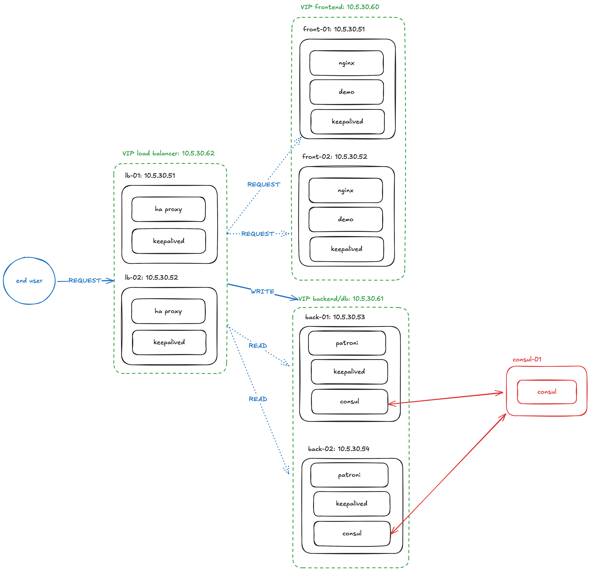

# Ansible experiments

This repository collects some ansible experiments into seperate playbooks and
roles. Please see the rest of this README for more details on each part or take a
look at the README of each role to see how to use it.

All ansible playbooks built on top of Alma Linux, a RHEL derived distribution to
resemble enterprise Linux setups closely. Any RHEL/yum/dnf based distribution
_should_ work, but the playbooks were designed and tested on Alma Linux 9 running
in LXC on Proxmox.

For the first run on clean system, ansible should either use a `sudo` enabled
user on the host (or not advised: use `root`) and the host should have sshd up
and running.

## Playbooks

* `webapp.yaml`: This playbook sets up the basics of a web application with HA
  components all around. It spins up a HA pair of NGINX web servers. Through
  these web servers, a small python flask web app is exposed. The web servers are
  HA through a VIP that's available on all hosts where `nginx` is running. The DB
  is available for reading on all nodes, but writing should only happen through
  the VIP that follows the Patroni leader.  
  At the moment this is the only playbook and it can easily be spun up with
  ```bash
  ansible-playbook ./webapp.yaml -i inventory
  ```

### Webapp

A couple of variables need to be configured for this role to work properly. In
`group_vars/all.yaml` at least a user (for future runs) should be defined.

```yaml
users:
- username: "deploy"
  ssh_pub_keys:
    - "<key>"
  shell: "/bin/bash"
```

We also configure the consul agent settings for nodes here. We run consul on all
nodes and connect to the consul servers for future work with service
discovery/key value store.

```yaml
consul:
  retry_join: ["10.5.30.55"]
  bind_addr: "{{ ansible_host }}"
  client_addr: "0.0.0.0"
```

The webapp frontend nodes have keepalived with a VIP available on all running
instances. This makes the frontend application available through the VIP, as long
as a single frontend node is running.

The backend/database servers are using Patroni to spin up a Postgresql cluster.
Patroni manages leader/replica configuration for this cluster and will
automically failover the leader if it stops. Keepalived tracks the Patroni leader
and assigns the database VIP to the leader. The database VIP should be used for
write operations and will only have minimal downtime between the leader election
and VIP assignment.

Database read operation can be send to any node on the cluster, but for HA should
also use the database VIP.



Scaling up to design beyond 2 nodes, several changes should be done to improve
usability and reliability:

* Since both NGINX and the demo application are stateless, no VIP is needed on
  the frontend nodes really. Each frontend node is capable of processing a
  request (as long as the frontend nodes have no state). By putting load
  balancers with a VIP in front of these frontend nodes, we can leverage the load
  balancing capabilities to spread the load over all frontend nodes.
* Using these load balancer we can also have seperate write/read paths for the
  database. The write path remains largely the same, with the load balancer send
  write requests to the VIP of the database cluster. Read requests could be load
  balanced over all nodes of the DB cluster, allowing for 0 downtime on the read path.



#### Consul

For the `[consul]` group, we enable consul server mode and specify a bind address
for it.

```yaml
consul:
  server: true
  retry_join: ["{{ ansible_host }}", "127.0.0.1"]
```

This wil setup a single node consul cluster. In case of multiple consul nodes,
  * [ ] the `retry_join` key needs to be adjusted to hold all the nodes in the consul
group (most likely something `{{ groups[consul] | join(', ') }}`).

#### Frontend

For the frontend group we configure the keepalived setup in which they'll run. In
the `group_vars/frontend.yaml` we can define the global settings

```yaml
keepalived:
  virtual_router_id: 100
  auth_pass: "hello12345world"
  virtual_ip: "10.5.30.60"
```

After which for each node we can configure the node specific setup in `host_vars/<node>.yaml`:

```yaml
keepalived:
  state: "MASTER|BACKUP"
  priority: <highest priority for master, lower for other nodes>
```

Since these servers also run the demo webapp, we can also specify the webapp
configuration in the `group_vars/frontend.yaml`:

```yaml
nginx:
  server_name: "vib.data.core" # which Host header needs to be receiver by nginx

python:
  host: "{{ ansible_host }}" # bind to the ansible hostname IP
  db:
    host: "10.5.30.61"
    port: 5432
    database: "foo"
    table: "bar"
    username: "hello"
    password: "world"
```

#### Database/backend

A database cluster needs to be bootstrapped from a single instance first as
setup, afterwards replicating to other nodes. We configure this "bootstrap" node
as the initial master for keepalived (and thus the databse VIP).

```yaml
group_vars/db-bootstrap.yaml
----------------------------
keepalived:
  state: "MASTER"
  priority: 200
```

All other nodes are configured as initial backup for keepalived. We also
configure the global keepalived settings here in `group_vars/db.yaml`:

```yaml
keepalived:
  state: "BACKUP"
  virtual_router_id: 100
  auth_pass: "hello12345world"
  virtual_ip: "10.5.30.61"
```

In the file it's possible to fine tune the settings for Patroni. The listed
settings belows should generally be changed from the defaults in
`roles/postgres/defaults` since otherwise the cluster will only be available from
the node itself and will fail to even cluster properly with other database nodes:

```yaml
postgres:
  data_directory: "/var/lib/postgres/17/data"
  home_directory: "/var/lib/postgres"
  listen_addresses: [ "*" ]
  trusted_network: "10.5.0.0/16"
  replication_network: "10.5.0.0/16"
  replication:
    username: "replication"
    password: "replication"
```

This playbook also allows for uploading of data, managing databases and users in
the postgres cluster. To make this possible we first look for which db node is
the leader in the cluster and only apply these tasks against it. Below you can
find an example for the inlucded csv about the quality of swimwater in Flanders.

```yaml
  data:
    - source: "test.csv"
      database: "core"
      table: "zwemwater"
      columns:
        - "id bigserial primary key"
        - "data int"
        - "uitstekend float"
        - "goed float"
        - "aanvaardbaar float"
        - "slecht float"
  databases:
    - name: "core"
  users:
    - name: "user"
      password: "data"
      database: "core"
```


